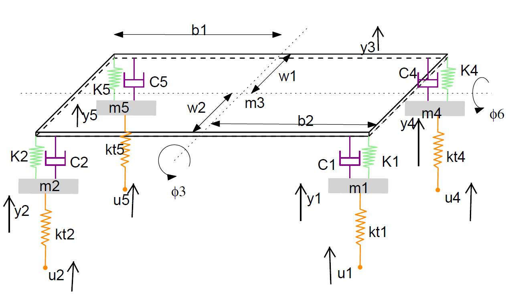

# Optimization Project
Course project for AE755 [Optimization for Engineering Design], Spring 2021

---

#### Project Title
> Design of Full Car Suspension Model to Maximize Rider Comfort

{:width="500px"}

### Usage
```
git clone https://github.com/trunc8/optimization-project.git
cd optimization-project
pip3 install -r requirements.txt
```

To check help menu and find list of algorithms
```
python3 code/suspension_optimization.py -h
```

To run the script against, say, Simulated Annealing
```
python3 code/suspension_optimization.py -a SA
```

To view intermediate design variable values, set the verbose flag (note that this will hide the progress bar)
```
python3 code/suspension_optimization.py -a SA -v
```

The results are automatically written to csv file with the corresponding algorithm name in the `results` directory.  
The suspension problem formulation is briefly discussed in our [presentation document](Presentation.pdf) along with collation of the results, our recommendations, and learnings.


Finally, in order to compare performance of all algorithms against the [test objective functions](code/test_objectives.py), execute
```
python3 code/testing.py
```

### Author(s)

* **Siddharth Saha** - [trunc8](https://github.com/trunc8)
* **Nabajyoti Majumdar** - [blackenwhite](https://github.com/blackenwhite)
* **Manthan Dhisale** - [ManthanND](https://github.com/ManthanND)
* **Saurabh Parekh** - [sp1999](https://github.com/sp1999)
* **Rohith Janjanam** - [RohithJanjanam45](https://github.com/RohithJanjanam45)
* **Ishan Phansalkar**
* **Chinmay Gandhshreewar**

<p align='center'>Created with :heart: by <a href="https://www.linkedin.com/in/sahasiddharth611/">Siddharth</a></p>